# Bodhi 用户指南：桌面 Agent 完整教程

Bodhi 是一个桌面优先的 AI Agent 工作台。它不是一个聊天框，而是一个完整的开发工作系统。本教程带你从安装到精通。

---

## 目录

1. [快速上手](#1-快速上手)
2. [主界面布局](#2-主界面布局)
3. [会话管理](#3-会话管理)
4. [Provider 配置](#4-provider-配置)
5. [模型限制](#5-模型限制)
6. [技能系统 (Skills)](#6-技能系统-skills)
7. [MCP 扩展](#7-mcp-扩展)
8. [工作流 (Workflow)](#8-工作流-workflow)
9. [定时调度 (Schedule)](#9-定时调度-schedule)
10. [Inspector 检查面板](#10-inspector-检查面板)
11. [Hooks 钩子系统](#11-hooks-钩子系统)
12. [环境变量](#12-环境变量)
13. [脱敏与安全](#13-脱敏与安全)
14. [指标监控 (Metrics)](#14-指标监控-metrics)
15. [提示词 (Prompts)](#15-提示词-prompts)
16. [通知系统](#16-通知系统)
17. [会话配置](#17-会话配置)
18. [应用管理](#18-应用管理)
19. [主题切换](#19-主题切换)

---

## 1. 快速上手

### 安装与启动

Bodhi 是一个 Tauri 桌面应用。启动后，你会看到一个完整的桌面窗口，左侧是会话列表，中央是对话区域。

**首次启动引导**：
- 引导式设置向导帮助你完成 Provider 配置
- 自动检测网络环境
- 确认基础选项后即可开始使用

### 最小可用路径

1. 点击「新建会话」创建一个新对话
2. 在底部输入框中描述你的任务
3. 按下回车发送，Agent 开始执行

```
最佳路径：先跑通一个简单任务 → 验证流程 → 逐步启用高级功能
```

---

## 2. 主界面布局


### 左侧：会话列表 (Chat Sidebar)

- **搜索框**：按关键词搜索历史会话
- **筛选标签**：全部 / 置顶 / 运行中 / 子会话
- **时间分组**：按日期自动分组，支持展开/折叠
- **置顶功能**：重要会话可置顶

### 中央：对话区域 (Conversation Pane)

- **消息流**：用户消息和 AI 回复按时间排列
- **推理面板**：可展开查看 AI 的推理过程 (Chain of Thought)
- **工具执行卡片**：每步工具调用以卡片形式展示，可展开查看详情
- **Diff 预览**：代码变更以 diff 形式展示

### 右侧：Inspector 检查面板

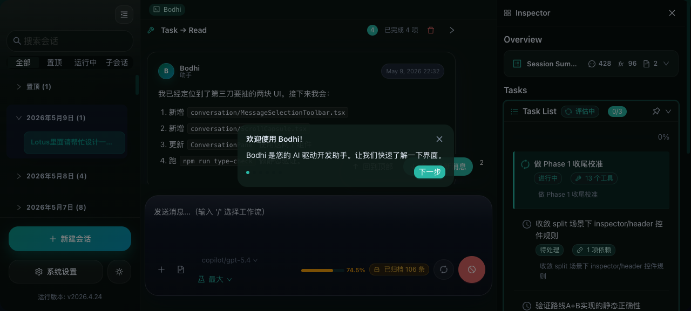

- **Overview**：会话概要、消息数、工具调用数统计
- **Tasks**：任务列表和进度追踪
- **Diffs**：所有文件变更汇总

### 顶部工具栏

| 按钮 | 功能 |
|------|------|
| 「新建会话」 | 创建新的聊天会话 |
| 「系统设置」 | 打开设置中心 |
| 「Light mode」 | 切换明暗主题 |

---

## 3. 会话管理

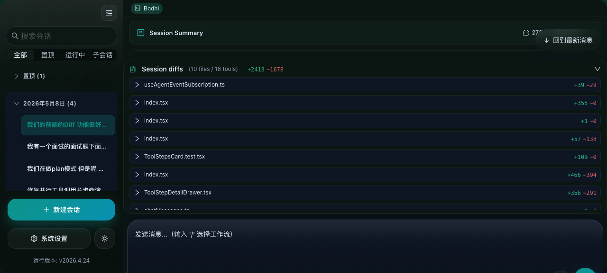

### 创建会话

点击左侧「新建会话」按钮，一个空白的聊天窗口打开。

### 搜索会话

在搜索框中输入关键词，会话列表实时过滤。

### 会话分组

- **全部**：显示所有会话
- **置顶**：仅显示已置顶的会话
- **运行中**：显示正在执行的会话
- **子会话**：显示子任务/子会话

### 会话操作

- **置顶/取消置顶**：点击会话旁的置顶按钮
- **删除**：每个日期分组可整组删除
- **导出消息**：选中消息后可导出

### 输入区域

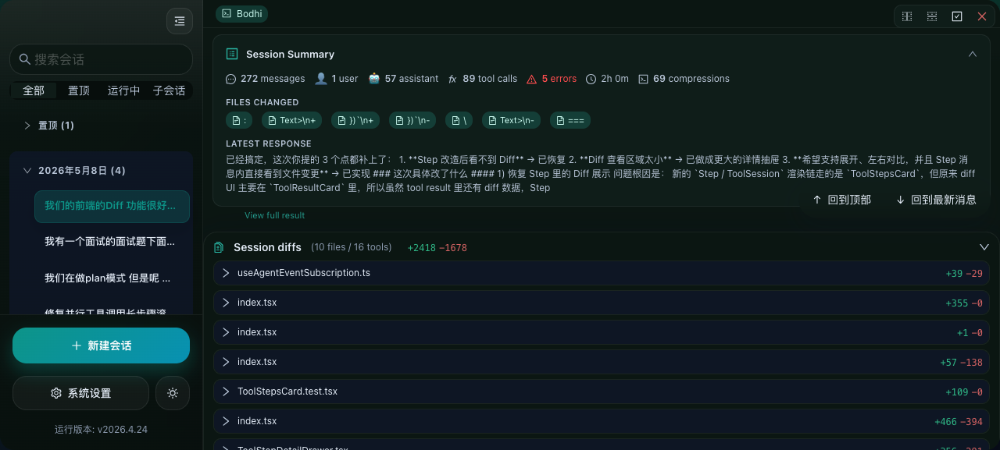

| 元素 | 说明 |
|------|------|
| 「发送消息...」 | 文本输入框，输入 `/` 可选择工作流 |
| 模型选择器 | 切换当前使用的 LLM 模型 |
| 推理强度 | 控制推理深度（低/中/最大） |
| 「添加附件」 | 添加文件附件 |
| 「引用工作区文件」 | 引用工作区中的文件 |

---

## 4. Provider 配置

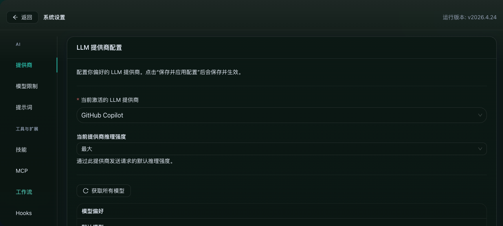

Bodhi 支持多种 LLM Provider，可在设置 → AI → 提供商中配置。

### 支持的 Provider

| Provider | 认证方式 | 说明 |
|----------|----------|------|
| **OpenAI** | API Key | 输入 API Key 和 Base URL |
| **Anthropic** | API Key | 支持 Max Tokens 和推理强度 |
| **Google Gemini** | API Key | Google 模型接入 |
| **GitHub Copilot** | OAuth | 通过 GitHub 账号认证 |
| **Bodhi** | 自定义 | 本地/自建服务 |

### 配置步骤

1. 展开对应的 Provider 面板
2. 填写 API Key（支持隐藏/显示切换）
3. 配置 Base URL（可选，用于代理）
4. 选择推理强度
5. 点击「保存并应用配置」

### 模型选择

每个 Provider 可配置：
- **默认模型**：从下拉列表中选择
- **模型过滤**：用通配符过滤可用模型，如 `gpt-5*`
- **获取所有模型**：从 API 刷新可用模型列表


---

## 5. 模型限制

设置 → AI → 模型限制

控制模型的调用边界：
- 最大 Token 数限制
- 单次调用超时设置
- 每轮最大工具调用次数
- 模型级别的调用频率限制

> 提示：通过模型限制，可以防止 Agent 在单次任务中消耗过多资源。

---

## 6. 技能系统 (Skills)

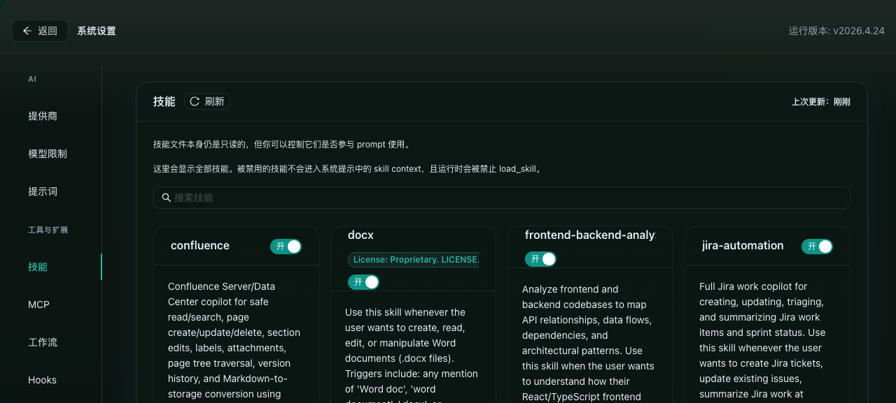

Skill 是 Bodhi 的专业工作模式系统。每个 Skill 定义了特定任务的工具选择、行为边界和输出格式。

### 管理技能

- **搜索**：按名称搜索技能
- **开关**：每个技能可独立启用/禁用
- **刷新**：从运行时重新加载技能列表

### 技能工作方式

当 Agent 检测到匹配的任务时，会自动加载对应技能的工作模式：
- 限定可用工具范围
- 注入专业的系统提示
- 定义输出结构和行为边界

---

## 7. MCP 扩展

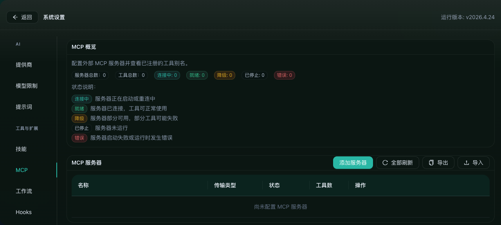

MCP (Model Context Protocol) 允许 Bodhi 连接外部工具和服务。

### MCP 服务器管理

| 操作 | 说明 |
|------|------|
| 「添加服务器」 | 配置新的 MCP 服务器 |
| 「全部刷新」 | 重新连接所有服务器 |
| 「导出」 | 导出当前 MCP 配置 |
| 「导入」 | 从文件导入 MCP 配置 |

### 双层架构

- **Built-in Tools** 负责核心基础能力（读写文件、执行命令、搜索代码）
- **MCP** 负责外部能力扩展（Jira、Confluence、GitHub 等）

> 设计原则：MCP 应该负责扩展边界，而不是替代内核。

---

## 8. 工作流 (Workflow)

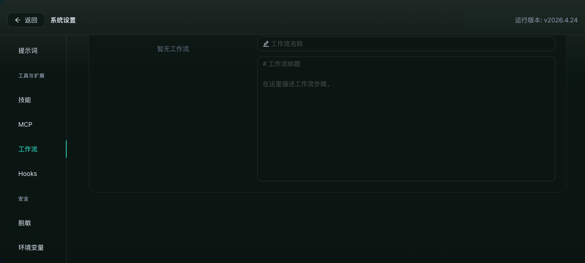

Workflow 是将成功执行保存为可复用模板的系统。

### 创建工作流

1. 完成一次有效的 Agent 任务执行
2. 将执行步骤保存为 Workflow
3. 命名并保存

### 使用工作流

在聊天输入框中输入 `/` 即可选择已保存的工作流：

```
/我的工作流名称
```

### 工作流的价值

```
单次任务成功
  ↓
保存为 Workflow（可复用模板）
  ↓
加入 Schedule（定时自动执行）
  ↓
持续自动化
```

---

## 9. 定时调度 (Schedule)

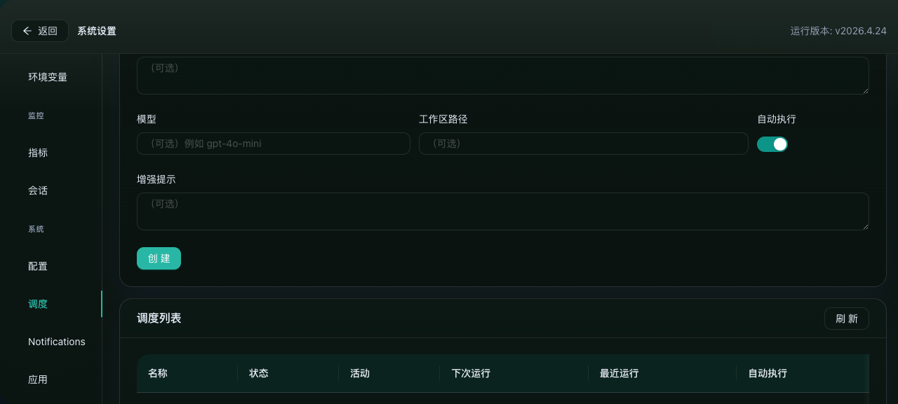

Schedule 让 Agent 按设定周期自动执行任务。

### 配置调度

| 参数 | 说明 |
|------|------|
| **名称** | 调度任务的名称 |
| **触发类型** | 间隔触发、定时触发等 |
| **启用开关** | 控制调度是否激活 |

### 使用场景

- 每日代码质量检查
- 定时文档更新
- 周期性数据报告
- 自动化 PR 审查

---

## 10. Inspector 检查面板


Inspector 是右侧信息面板，提供执行过程的全局视图。

### Overview (概览)

- 会话信息概要
- 消息数统计 (message)
- 工具调用统计 (function)
- 文件变更统计 (file-text)

### Tasks (任务)

- 任务列表展示
- 任务完成进度
- 点击可查看任务详情

### Diffs (代码变更)

- 汇总所有文件变更
- 每文件显示 +行/-行 统计
- 点击可展开查看具体变更内容

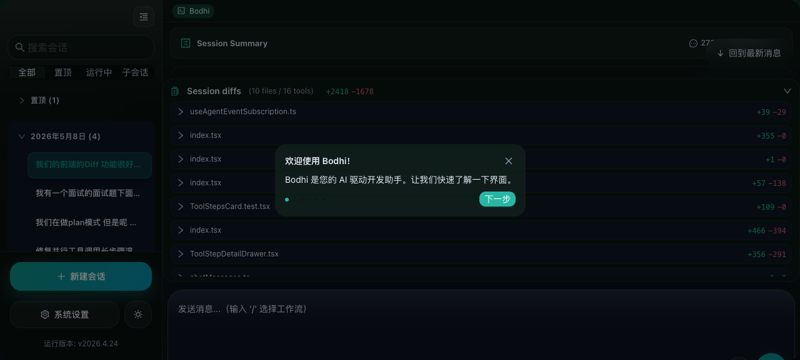
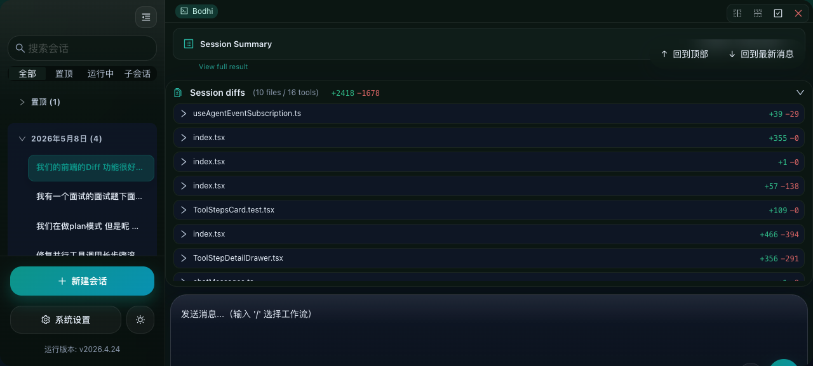

---

## 11. Hooks 钩子系统

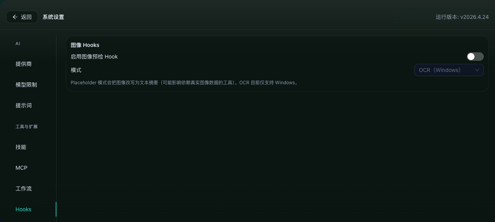

Hooks 是在 Agent 生命周期的特定节点执行自定义 Shell 命令的系统。

### 可用钩子

- **pre-execution**：执行前触发
- **post-execution**：执行后触发
- **on-error**：错误时触发
- **on-complete**：完成时触发

### 配置方式

在设置 → Hooks 中配置 Shell 命令和触发条件。

---

## 12. 环境变量

设置 → 环境变量

管理运行时环境变量：

| 变量 | 说明 |
|------|------|
| `AGENT_MAX_ITERATIONS` | Agent 最大迭代次数 |
| `AGENT_TIMEOUT_SECS` | Agent 执行超时（秒） |
| 自定义变量 | 用户自定义环境变量 |

> 环境变量影响所有 Agent 执行行为，修改需谨慎。

---

## 13. 脱敏与安全

设置 → 脱敏

### 脱敏功能

保护敏感信息不泄露到 LLM：
- API Key 自动脱敏
- 密码字段隐藏
- 敏感路径过滤
- 自定义脱敏规则

### 安全设置

- 权限类型管理（6 种权限类型）
- 风险等级标注
- 审批卡片机制

---

## 14. 指标监控 (Metrics)

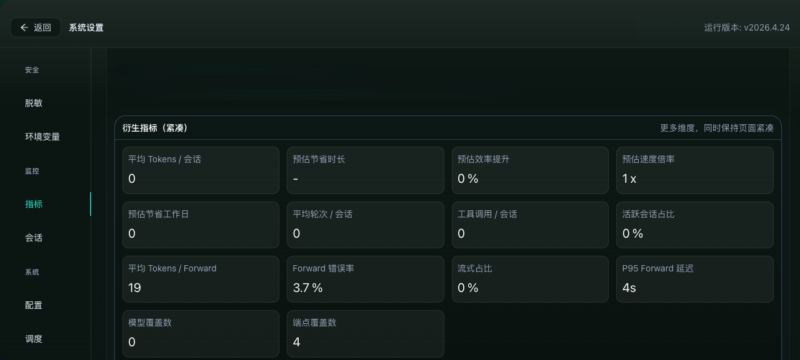

### 概览面板

- 总 Token 消耗
- 缓存命中率
- 调用次数趋势
- 按模型分组的用量统计

### 子面板

| 面板 | 内容 |
|------|------|
| **概览** | 整体使用统计 |
| **聊天** | 聊天维度的指标 |
| **技能 & MCP** | 技能和 MCP 调用统计 |
| **Forward** | 转发统计 |
| **记忆** | 记忆系统使用情况 |
| **记录** | 详细使用日志 |

### 筛选条件

- **日期范围**：自定义起止日期
- **模型**：按模型筛选
- **时间粒度**：30天/7天/按天/按小时

---

## 15. 提示词 (Prompts)

设置 → 提示词

自定义系统提示词，精细调整 Agent 行为：
- 系统角色定义
- 任务边界描述
- 输出格式要求
- 行为约束

---

## 16. 通知系统

设置 → Notifications

配置 Agent 通知方式：
- 任务完成通知
- 错误告警
- 审批请求通知
- 自定义通知规则

---

## 17. 会话配置

设置 → 会话

全局会话设置：
- 最大会话历史保留天数
- 自动压缩策略
- 默认模型和推理强度
- 子会话行为配置

---

## 18. 应用管理

设置 → 应用

查看应用信息：
- 运行版本号
- 系统状态
- 配置导入/导出
- 数据备份/恢复

---

## 19. 主题切换

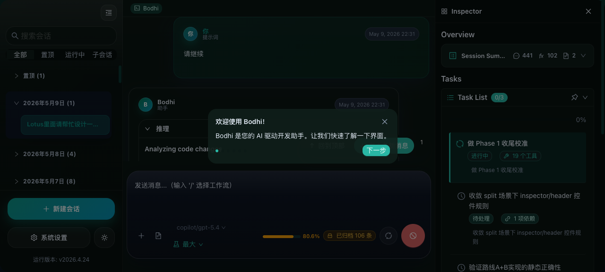

Bodhi 支持明暗双主题，通过左下角「Light mode」/「Dark mode」按钮切换。

---

## 常见问题

### Q: Agent 在某一轮卡住了怎么办？
点击「取消请求」停止当前执行，然后重新发送消息。

### Q: 如何调整 Token 消耗？
1. 在「模型限制」中设置上限
2. 在 Provider 配置中降低 Max Tokens
3. 选择推理强度为「低」

### Q: 如何接入自己的工具？
通过 MCP 协议添加自定义服务器，或在 Hooks 中配置 Shell 脚本。

### Q: 代码变更如何追踪？
Inspector 面板的 Diffs 区域实时展示所有文件变更，点击可查看详情。

---

## 相关链接

- [Zenith 架构总览](./zenith-architecture-overview.md)
- [我为什么构建自己的 Agent](./why-i-built-my-own-agent.md)
- [CI/CD 与发布系统](./ci-cd-and-release-system.md)
- [多 Agent 协作](./multi-agent-collaboration.md)
- [Bodhi Server 详解](./bodhi-server-deep-dive.md)
